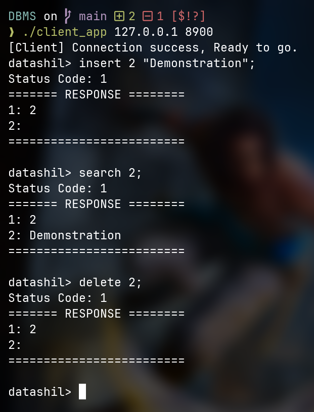

# Datashil

---

A lightweight, disk-based database engine written in modern C++. The project was built to explore the design and implementation of database storage systems from first principles, with a focus on building a persistent index and the infrastructure required to manage data reliably on disk. It includes a custom storage engine, a TCP server, and a simple CLI for interacting with the database.

**For architectural deatils refer to [architectural file](/Architecture.md).** 


## Features

- Persistent disk-based B+ tree storage engine
- Clustered index implementation
- Slotted leaf pages for variable-sized tuples
- Lazy deletion with on-demand page defragmentation
- Automatic internal and leaf node splitting on overflow
- Internal and leaf node redistribution and merging on underflow
- Streaming payload interface for incremental tuple retrieval
- Clock-Sweep replacement policy
- Direct I/O (`O_DIRECT`) with aligned memory management, bypassing the Linux page cache
- Page management and storage layer
- TCP server exposing the storage engine over a custom binary protocol
- Interactive CLI with a simple DFA query parser
- Catch2-based test suite with generated datasets

## Repository Layout

- `commons/` shared types, constants, and utilities
- `database/` storage engine, server, and tests
- `client/` tcp client for server interaction with a simple cli for demonstration

## Prerequisites

- `g++` with C++17 and above supported
- `make`
- Python 3 for generating test data

## Build

Build both the server and client binaries:

```bash
make
```

This produces:

- `server_app`
- `client_app`

Clean generated binaries and object files:

```bash
make clean
```

## Run the Server

Start the database server with a path to the database file or directory:

```bash
./server_app <database_path> [port]
```

The database file is formed along with all its parent folders if needed.

## Run the Client

The client includes a simple interactive CLI for demonstration purposes.

Connect the client-CLI to the server with a host and port:

```bash
./client_app <host> <port>
```

Once connected, enter commands at the `datashil>` prompt.

### Supported Commands

- A simple parser is implemented to parse the queries.
- Commands are terminated with a semicolon and use a simple grammar.

```text
search <key>;
insert <key> "<payload>";
delete <key>;
```

**Example session:**
<div>

</div>

## Tests

Generate the test datasets and run the test binary with:

```bash
make generate_data
make test
```

The test suite covers:

- B+ tree insertion
- Search
- Deletion
- Persistence
- Page defragmentation

Stress tests include:

- Up to 60,000 inserted records
- Payloads up to 10,000 bytes
- 30,000 deletions using multiple deletion patterns

## Notes

- Test data is stored in `database/tests/data/`.
- Communication between the client and server uses a custom binary protocol with checksum validation.

## Future Plans

- Write-Ahead Logging (WAL) for crash recovery and durability
- Concurrent B+ tree operations with page latching
- Variable-sized key support
- External merge sort for disk-resident datasets
- Disk-based hash index
- Free-page reclamation and database file compaction
---
